<p align="center">
  
</p>

<h1 align="center">ProxCenter</h1>

<p align="center">
  <strong>Enterprise-grade management platform for Proxmox Virtual Environment</strong>
</p>

<p align="center">
  
  
  
  
</p>

---

## Overview

**ProxCenter** provides a modern, unified web interface for monitoring, managing, and optimizing your Proxmox virtualization infrastructure. Manage multiple clusters, automate workload balancing, and gain deep insights into your infrastructure.

<p align="center">
  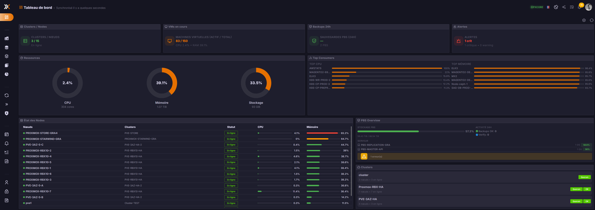
</p>

---

## Features

### 📊 Infrastructure Monitoring

Real-time monitoring with health scores, top consumers, and multi-cluster overview.

- Clusters and nodes status at a glance
- CPU, Memory, and Storage utilization gauges
- Top resource consumers
- Backup status and alerts overview

<p align="center">
  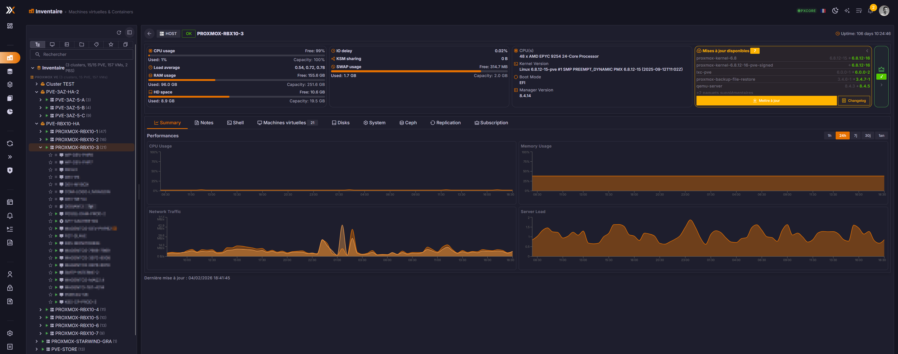
</p>

<p align="center">
  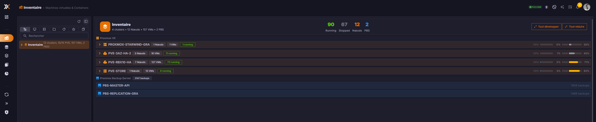
</p>

---

### 📈 Resource Trends & AI Insights

Comprehensive resource analysis with historical trends and AI-powered predictions.

- Historical resource usage evolution
- Capacity projections and predictions
- AI-assisted trend analysis
- Green IT / Environmental impact metrics
- Overprovisioning detection

<p align="center">
  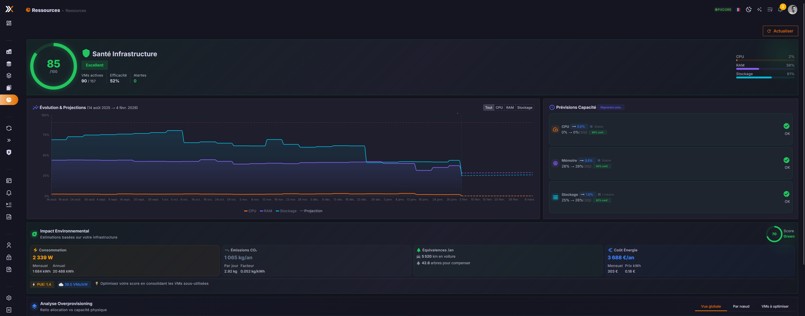
</p>

<p align="center">
  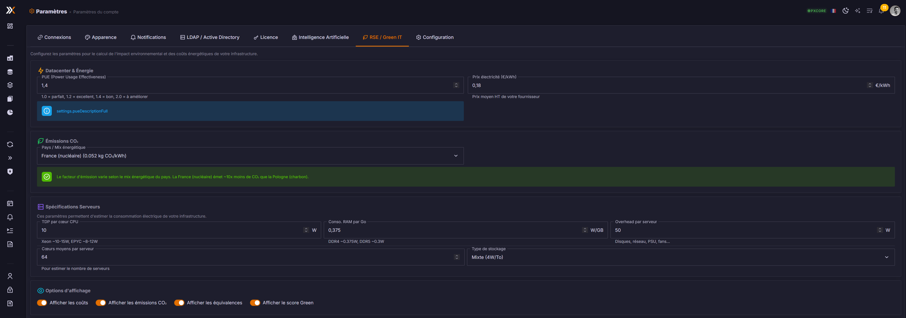
</p>

---

### ⚖️ DRS - Distributed Resource Scheduler

Intelligent workload balancing across your Proxmox nodes.

- Automatic and manual balancing modes
- CPU, memory, and storage-aware scheduling
- Affinity and anti-affinity rules
- Migration recommendations with one-click execution

<p align="center">
  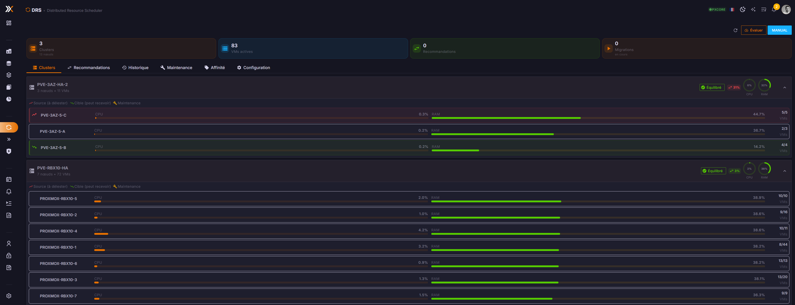
</p>

---

### 🔄 Rolling Updates

Orchestrated node updates with zero-downtime VM migrations.

- Automated pre-migration before updates
- Progress tracking per node
- Rollback capabilities
- Update scheduling

<p align="center">
  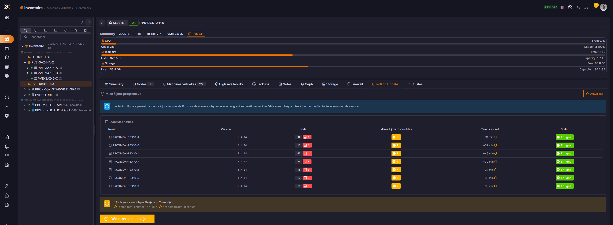
</p>

<p align="center">
  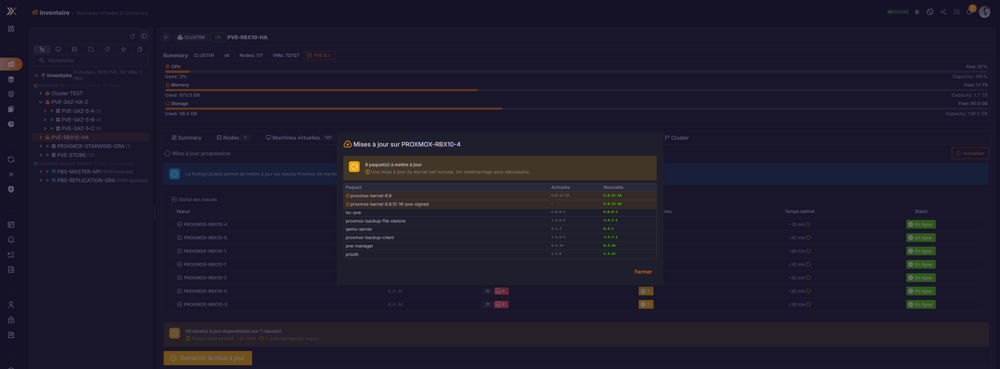
</p>

---

### 🔀 Cross-Cluster Migration

Migrate VMs between different Proxmox clusters seamlessly.

- Cross-cluster VM migration
- Storage and network mapping
- Live migration support
- Migration progress tracking

<p align="center">
  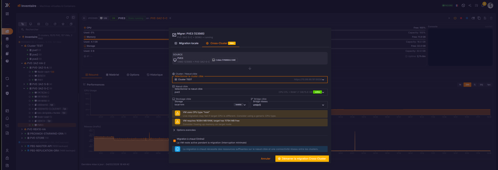
</p>

---

### 🛡️ Firewall & Micro-segmentation

Centralized firewall management with Zero Trust security model.

- Security groups management
- VM-level firewall rules
- Cluster-wide policies
- Zero Trust recommendations

<p align="center">
  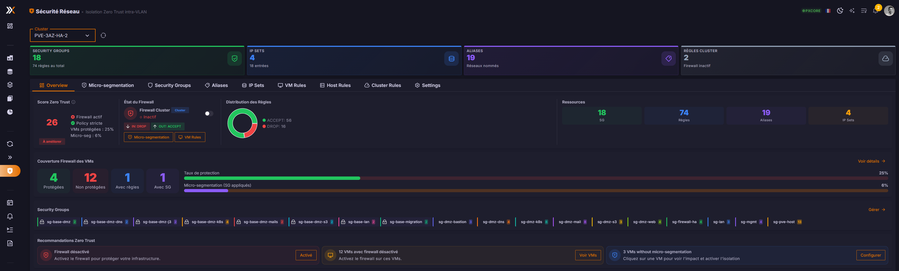
</p>

<p align="center">
  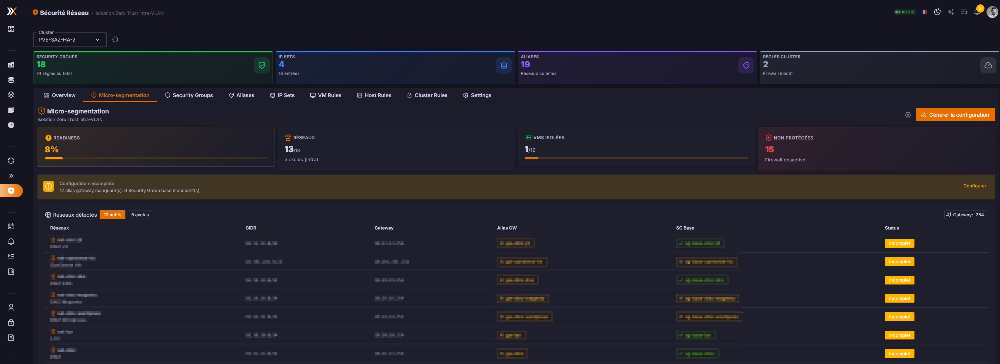
</p>

---

### 💾 Backup Monitoring (PBS)

Monitor and manage Proxmox Backup Server datastores.

- Datastore health and capacity
- Backup job monitoring
- Verification status
- Storage statistics

<p align="center">
  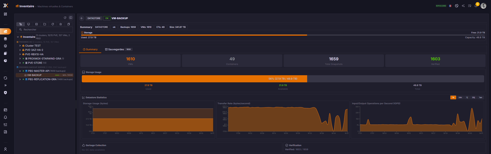
</p>

<p align="center">
  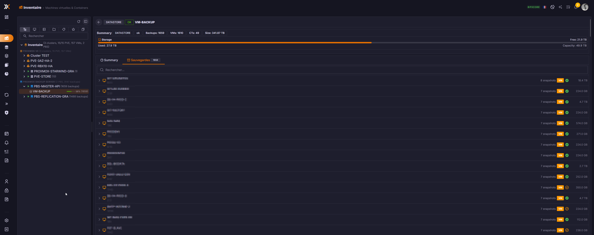
</p>

---

### 🗄️ Ceph Storage Management

Monitor and manage Ceph distributed storage clusters.

- Ceph cluster health and status
- OSD nodes monitoring
- Storage pools capacity
- Performance metrics and IOPS
- Replication status

<p align="center">
  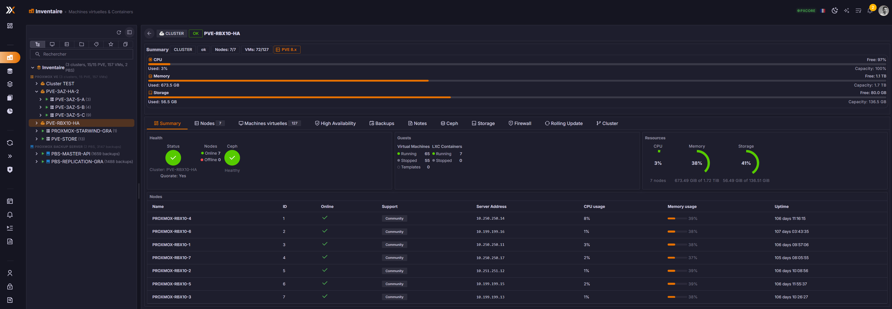
</p>

<p align="center">
  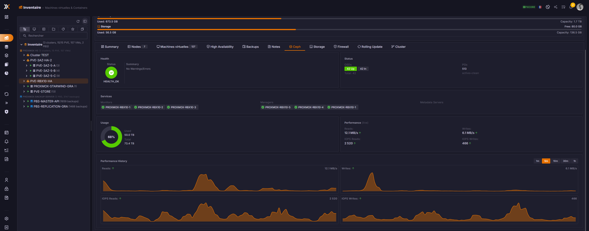
</p>

<p align="center">
  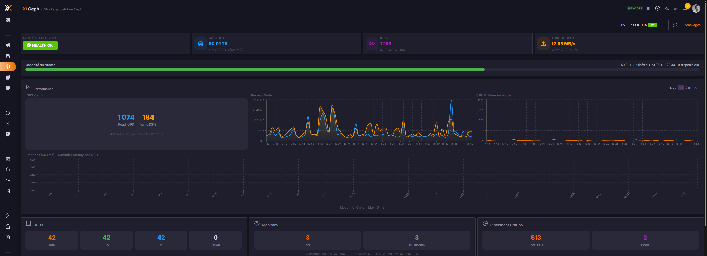
</p>

---

### 🚨 Alerts & Notifications

Comprehensive alerting system with email notifications.

- Real-time alerts dashboard
- Configurable thresholds
- Email notifications (SMTP)
- Alert history and acknowledgment

<p align="center">
  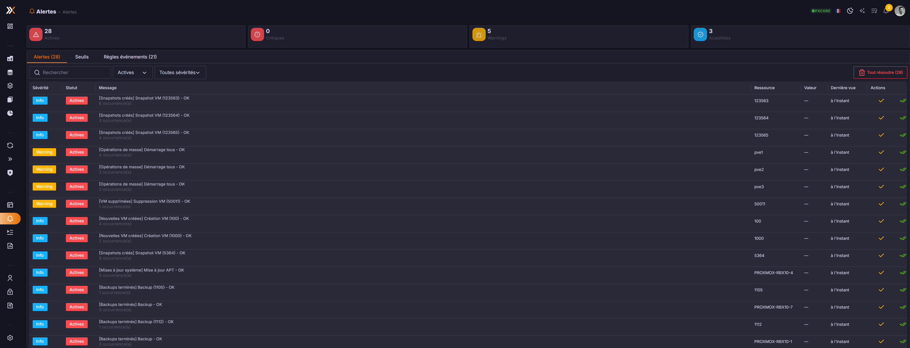
</p>

<p align="center">
  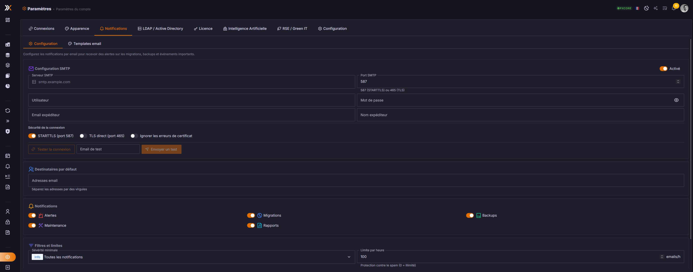
</p>

---

### 📄 Enterprise Reports

Generate professional PDF reports with AI-powered insights.

- Infrastructure reports
- Capacity planning reports
- Utilization analysis
- Multi-language support (EN/FR)
- AI-powered recommendations (Ollama, OpenAI, Anthropic)

<p align="center">
  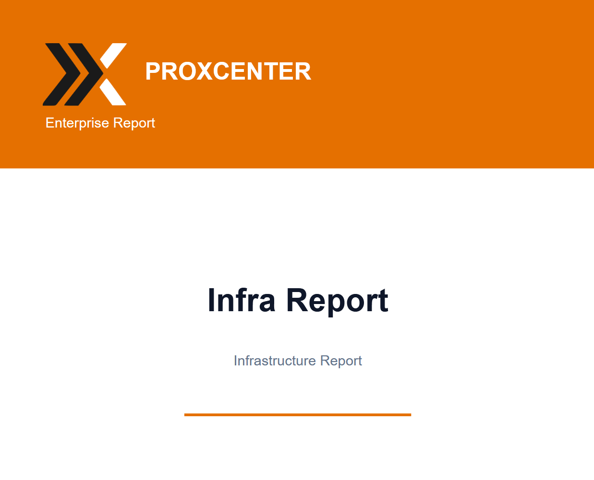
  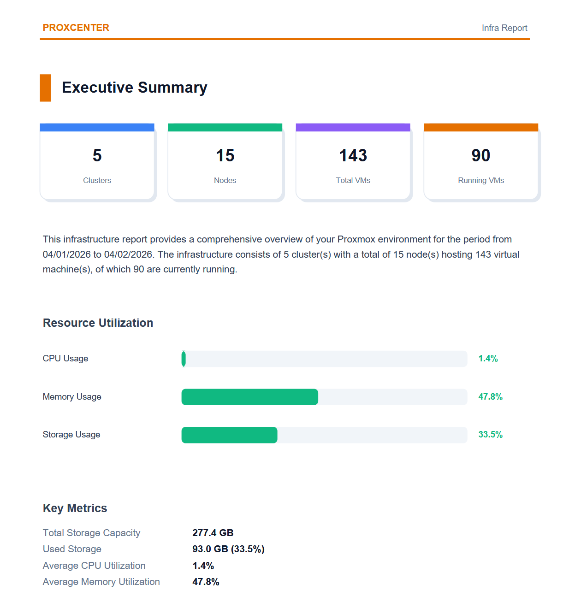
</p>

---

### 🎨 Customization

Multiple themes and appearance options.

- Light, Dark, and System modes
- Multiple color schemes
- High contrast accessibility option
- Customizable dashboard

<p align="center">
  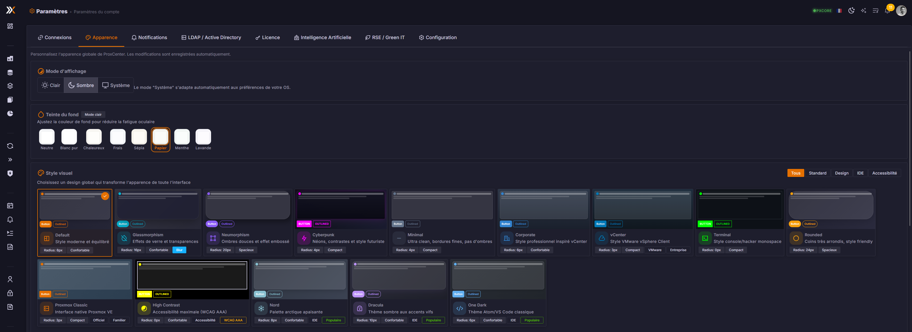
</p>

---

### 🔐 Enterprise Authentication

LDAP and Active Directory integration for enterprise environments.

<p align="center">
  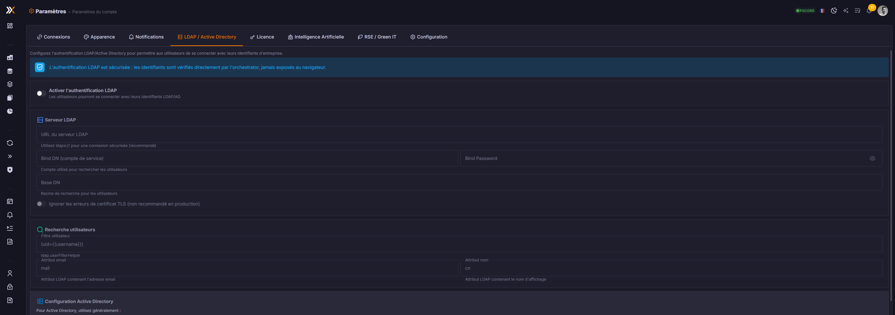
</p>

---

## Architecture

```
proxcenter/
├── frontend/          # Next.js web application
│   ├── src/
│   │   ├── app/       # Next.js App Router
│   │   ├── components/
│   │   └── lib/
│   └── prisma/        # Database schema
│
└── backend/           # Go orchestrator service
    ├── cmd/
    │   └── orchestrator/
    └── internal/
        ├── api/       # REST API handlers
        ├── drs/       # Resource scheduler
        ├── metrics/   # Metrics collection
        ├── proxmox/   # Proxmox API client
        ├── reports/   # PDF report generation
        └── ...
```

## Requirements

### Frontend
- Node.js 18+ or 20+
- pnpm (recommended) or npm

### Backend
- Go 1.24+
- SQLite3

### Runtime
- Proxmox VE 7.0+ or 8.0+
- Network access to Proxmox API (port 8006)

## Quick Start

### 1. Clone the repository

```bash
git clone https://github.com/adminsyspro/proxcenter.git
cd proxcenter
```

### 2. Configure the Backend

```bash
cd backend

# Copy example configuration
cp config.yaml.example config.yaml

# Edit config.yaml with your settings
# Important: Set app_secret to match frontend APP_SECRET

# Build the orchestrator
go build -o orchestrator ./cmd/orchestrator

# Create data directory
mkdir -p data

# Run the orchestrator
./orchestrator
```

### 3. Configure the Frontend

```bash
cd frontend

# Copy example environment
cp .env.example .env

# Edit .env with your settings
# Important: Set APP_SECRET (must match backend config)

# Install dependencies
pnpm install

# Initialize the database
pnpm prisma migrate deploy

# Run development server
pnpm dev
```

### 4. Access ProxCenter

Open http://localhost:3000 in your browser.

## Configuration

### Frontend (.env)

| Variable | Description | Default |
|----------|-------------|---------|
| `DATABASE_URL` | SQLite database path | `file:./data/proxcenter.db` |
| `APP_SECRET` | Encryption key for credentials | Required |
| `NEXTAUTH_SECRET` | NextAuth.js session secret | Required |
| `NEXTAUTH_URL` | Application URL | `http://localhost:3000` |
| `ORCHESTRATOR_URL` | Backend API URL | `http://localhost:8080` |

### Backend (config.yaml)

See `backend/config.yaml.example` for all available options.

Key settings:
- `proxmox.app_secret` - Must match frontend `APP_SECRET`
- `proxmox.proxcenter_db_path` - Path to frontend database
- `drs.*` - Resource scheduler configuration
- `notifications.email.*` - SMTP settings for alerts

## Production Deployment

### Using Docker

```bash
cd backend
docker-compose up -d
```

### Manual Deployment

1. Build frontend: `cd frontend && pnpm build`
2. Build backend: `cd backend && go build -o orchestrator ./cmd/orchestrator`
3. Configure reverse proxy (nginx/traefik)
4. Set up systemd services
5. Configure SSL certificates

## License

ProxCenter is proprietary software. Enterprise licenses are available for commercial use.

## Support

- GitHub Issues: [adminsyspro/proxcenter](https://github.com/adminsyspro/proxcenter/issues)

---

<p align="center">
  
  <br>
  <strong>ProxCenter</strong> - Enterprise Proxmox Management Made Simple
</p>
