<p align="center">
  <picture>
    <source media="(prefers-color-scheme: dark)" srcset="docs/logo-dark.svg">
    <source media="(prefers-color-scheme: light)" srcset="docs/logo.svg">
    
  </picture>
</p>

<h1 align="center">ProxCenter</h1>

<p align="center">
  <strong>Enterprise-grade management platform for Proxmox Virtual Environment</strong>
</p>

<p align="center">
  
  
  
  
  
</p>

<p align="center">
  <a href="https://github.com/adminsyspro/proxcenter-ui/actions/workflows/docker-publish.yml"></a>
  <a href="https://github.com/adminsyspro/proxcenter-ui/actions/workflows/codeql.yml"></a>
  <a href="https://github.com/adminsyspro/proxcenter-ui/actions/workflows/security-scan.yml"></a>
</p>

---

## Overview

**ProxCenter** provides a modern, unified web interface for monitoring, managing, and optimizing your Proxmox virtualization infrastructure. Manage multiple clusters, automate workload balancing, migrate from other hypervisors, and gain deep insights into your infrastructure.

<p align="center">
  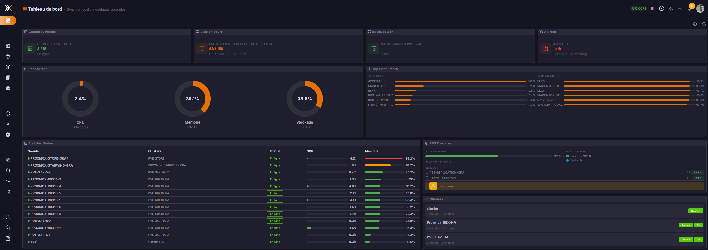
</p>

---

## Quick Start

### Community Edition (Free)

```bash
curl -fsSL https://proxcenter.io/install/community | sudo bash
```

### Enterprise Edition

```bash
curl -fsSL https://proxcenter.io/install/enterprise | sudo bash -s -- --token YOUR_TOKEN
```

[Get your Enterprise license](https://proxcenter.io/pricing)

---

## Features at a Glance

| Feature | Community | Enterprise |
|---|:---:|:---:|
| **Monitoring & Dashboard** | | |
| Dashboard & Health Scores | ✅ | ✅ |
| Events Log | ✅ | ✅ |
| Resource Trends & AI Insights | | ✅ |
| Green IT / Environmental Metrics | | ✅ |
| **Infrastructure** | | |
| Inventory (Nodes, VMs, CTs) | ✅ | ✅ |
| VM Operations (clone, snapshot, resize, move disk) | ✅ | ✅ |
| Topology Map (Infrastructure, Network, Geo views) | ✅ | ✅ |
| Storage Management | ✅ | ✅ |
| Ceph Monitoring | ✅ | ✅ |
| Backup Monitoring (PBS) | ✅ | ✅ |
| SSH Remote Management | ✅ | ✅ |
| **Provisioning** | | |
| VM/CT Templates & Cloud Images | ✅ | ✅ |
| Custom Images | ✅ | ✅ |
| Blueprints (reusable VM configurations) | ✅ | ✅ |
| **Migration** | | |
| Cross-Cluster Migration (PVE ↔ PVE) | | ✅ |
| VMware ESXi → Proxmox Migration | ✅ | ✅ |
| XCP-ng (XO) → Proxmox Migration | ✅ | ✅ |
| **Orchestration** | | |
| DRS (Distributed Resource Scheduler) | | ✅ |
| Rolling Updates (zero-downtime) | | ✅ |
| Site Recovery (Ceph Replication) | | ✅ |
| Task Center (Scheduled Jobs) | | ✅ |
| **Networking & Security** | | |
| Network Microsegmentation | | ✅ |
| Alerts & Notifications (SMTP) | | ✅ |
| Change Tracking | | ✅ |
| **Access Control** | | |
| User Management | ✅ | ✅ |
| OIDC / SSO Authentication | ✅ | ✅ |
| RBAC (Role-Based Access Control) | | ✅ |
| LDAP / Active Directory | | ✅ |
| Audit Logs | ✅ | ✅ |
| Compliance Dashboard | | ✅ |
| **Reports & UX** | | |
| Reports (PDF, AI-powered) | | ✅ |
| Web Terminal (xterm.js) | ✅ | ✅ |
| VNC Console (noVNC) | ✅ | ✅ |
| Themes & Customization | ✅ | ✅ |
| Multi-language (EN/FR) | ✅ | ✅ |

---

## Community Features

### Dashboard

Real-time monitoring with health scores, top consumers, and multi-cluster overview.

- Clusters and nodes status at a glance
- CPU, Memory, and Storage utilization gauges
- Top resource consumers
- Backup status and alerts overview

### Inventory

Browse and manage all nodes, VMs, and containers across clusters with a rich tree view.

- Tree view with Storage, Network, Backup, and Migration sections
- VM operations: clone, snapshot, resize disk, move disk, migrate
- Live status monitoring per VM/CT
- Multi-cluster support with connection filtering

<p align="center">
  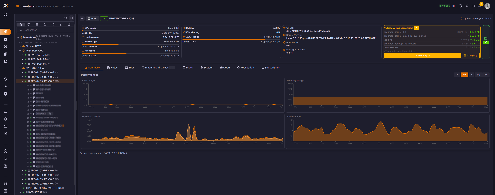
</p>

<p align="center">
  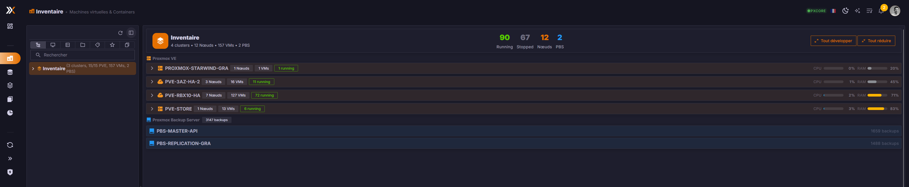
</p>

### Web Terminal & VNC Console

Access node shells, VM consoles, and LXC terminals directly from your browser.

- **xterm.js** terminal for node/VM/CT shell access
- **noVNC** console for graphical VM access
- Unified WebSocket proxy on a single port (no extra port needed)

### Topology Map

Visual topology of your infrastructure with three views:

- **Infrastructure view** — Hierarchical cluster → node → VM layout
- **Network view** — Bridge/VLAN-centric topology with VM connections
- **Geo view** — Geographic map with cluster locations
- PNG export for documentation

### Templates & Blueprints

Deploy VMs from cloud images or custom templates in a few clicks.

- Cloud image catalog (Ubuntu, Debian, Fedora, Rocky, Alpine, etc.)
- Custom image management (upload from URL or existing volume)
- Blueprints: save and reuse full VM configurations (hardware + cloud-init)

### Storage & Ceph

Monitor and manage storage, including Ceph distributed storage clusters.

- Ceph cluster health, OSD nodes, pools capacity
- Performance metrics and IOPS
- Replication status

<p align="center">
  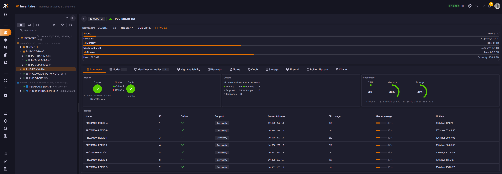
</p>

### Backup Monitoring (PBS)

Monitor Proxmox Backup Server datastores and backup jobs.

<p align="center">
  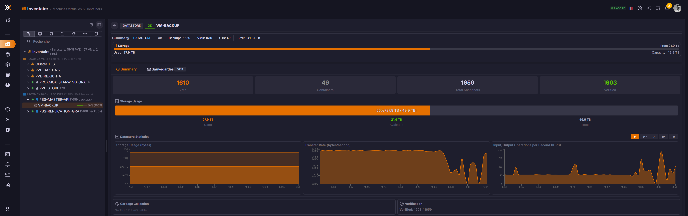
</p>

### Cross-Hypervisor Migration

Migrate VMs from other hypervisors to Proxmox VE.

- **VMware ESXi → Proxmox**: Full VM migration with disk conversion (VMDK → raw/qcow2), EFI support, and automatic configuration
- **XCP-ng (XO) → Proxmox**: Migrate from Xen Orchestra with VHD disk conversion and hardware reconfiguration
- Progress tracking with detailed logs per disk
- Automatic boot order and hardware configuration

### SSH Remote Management

Execute commands on Proxmox nodes directly from ProxCenter.

- Private key or password authentication
- Per-node SSH address override
- Sudo support for non-root users

### Customization

- Light, Dark, and System modes
- Multiple color schemes
- Multi-language support (English, French)

<p align="center">
  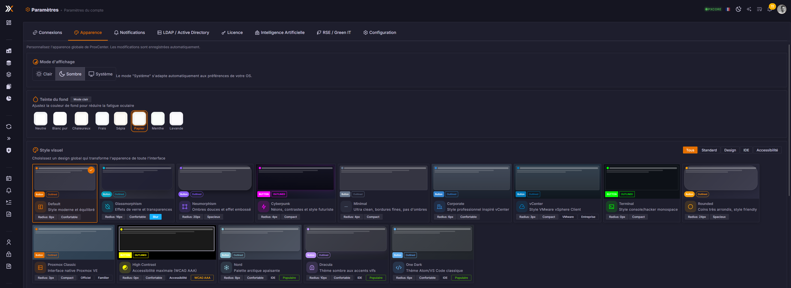
</p>

---

## Enterprise Features

### DRS - Distributed Resource Scheduler

Intelligent workload balancing across your Proxmox nodes.

- Automatic and manual balancing modes
- CPU, memory, and storage-aware scheduling
- Affinity and anti-affinity rules
- Migration recommendations with one-click execution

<p align="center">
  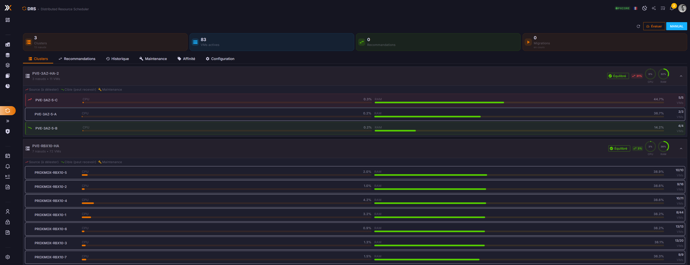
</p>

### Resource Trends & AI Insights

Comprehensive resource analysis with historical trends and AI-powered predictions.

- Historical resource usage evolution
- Capacity projections and predictions
- AI-assisted trend analysis
- Green IT / Environmental impact metrics

<p align="center">
  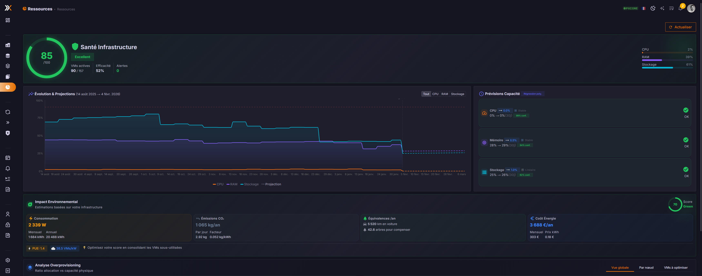
</p>

<p align="center">
  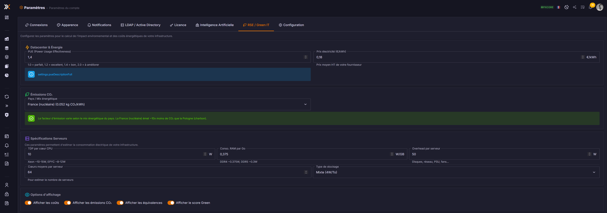
</p>

### Rolling Updates

Orchestrated node updates with zero-downtime VM migrations.

- Automated pre-migration before updates
- Progress tracking per node
- Rollback capabilities

<p align="center">
  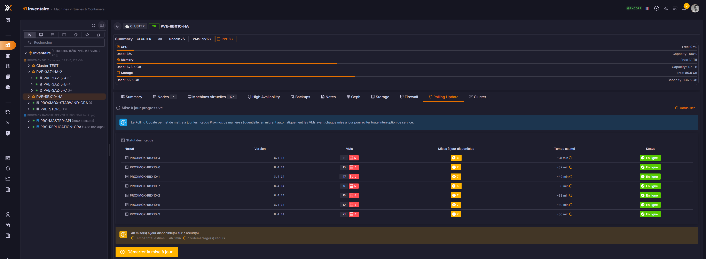
</p>

### Cross-Cluster Migration

Migrate VMs between different Proxmox clusters seamlessly.

<p align="center">
  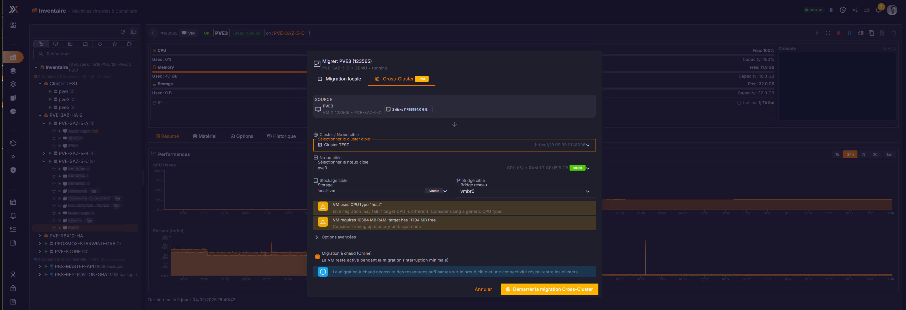
</p>

### Network Microsegmentation

Centralized firewall management with Zero Trust security model.

- Security groups management
- VM-level firewall rules
- Cluster-wide policies

<p align="center">
  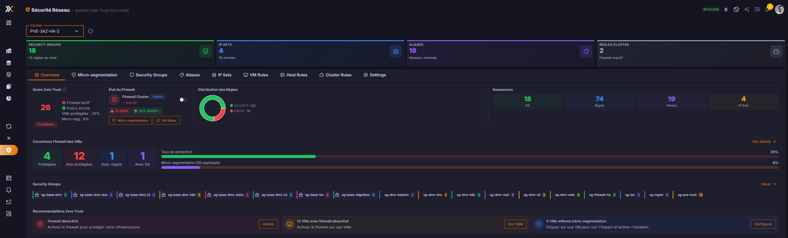
</p>

### Alerts & Notifications

Real-time alerts with configurable thresholds and email notifications (SMTP).

<p align="center">
  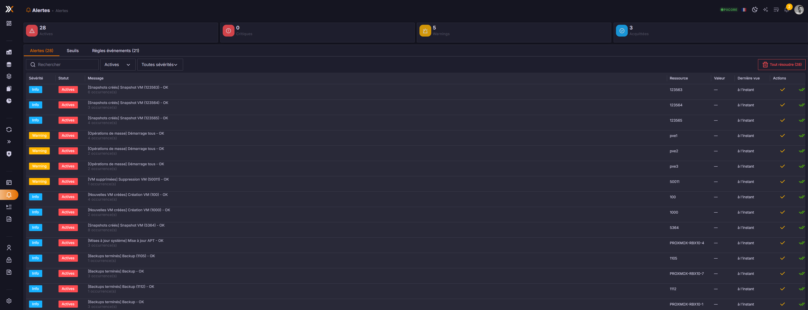
</p>

### Reports

Generate professional PDF reports with AI-powered insights (Ollama, OpenAI, Anthropic).

<p align="center">
  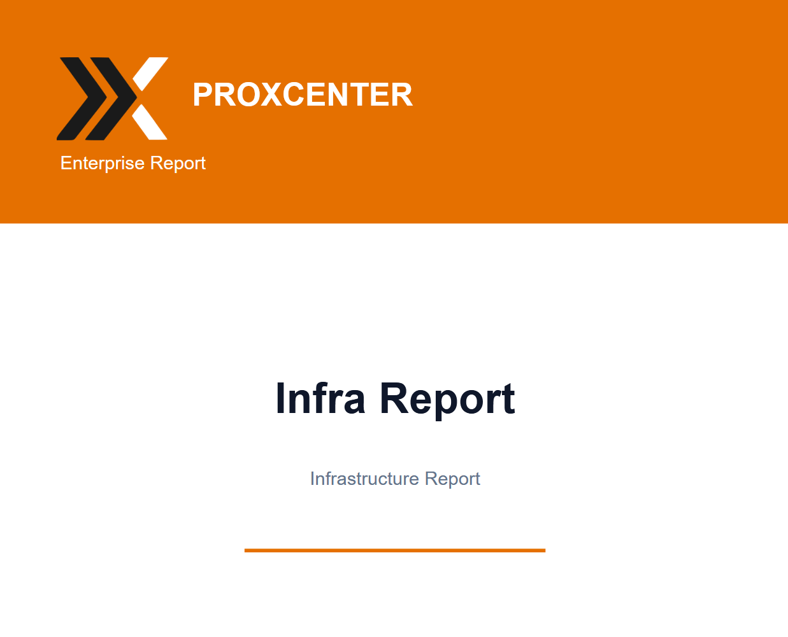
  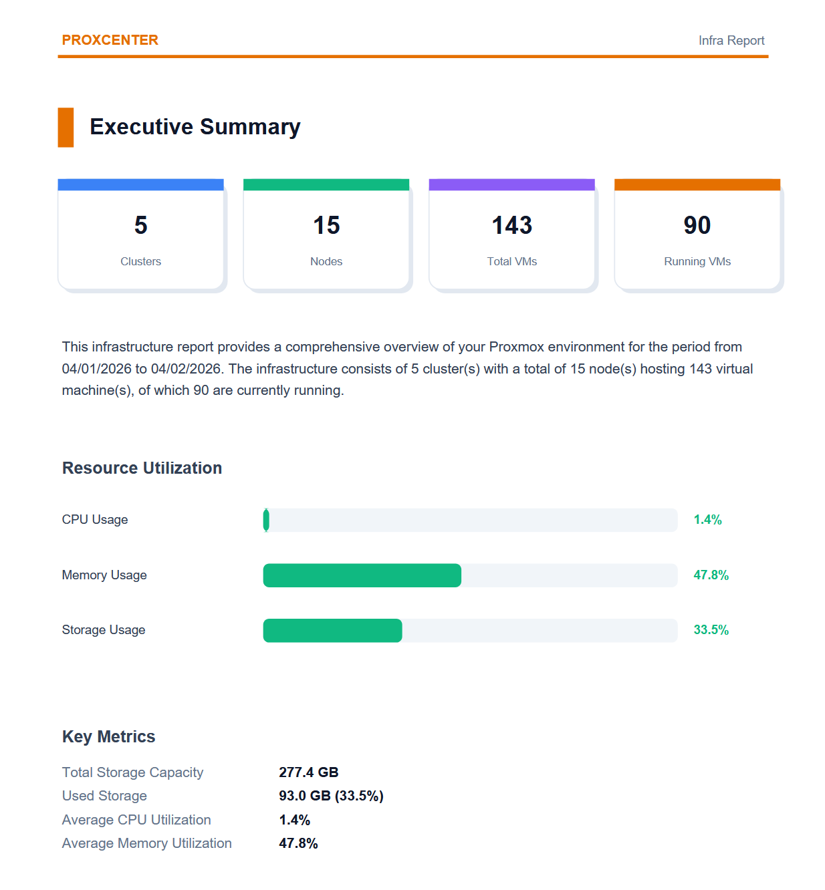
</p>

### RBAC & Authentication

- Role-based access control with custom roles and permissions
- OIDC / SSO integration
- LDAP and Active Directory integration
- Audit log for all user actions
- Compliance dashboard

<p align="center">
  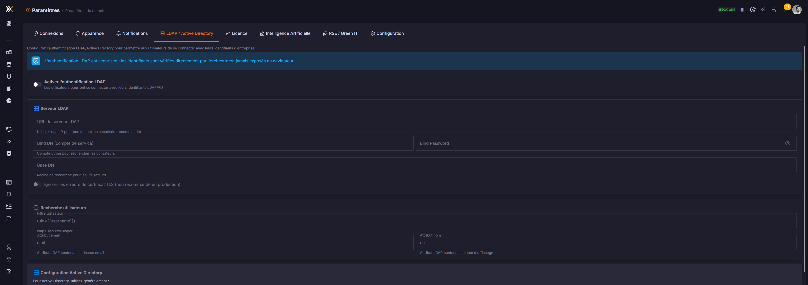
</p>

---

## Architecture

```
                          +-----------------------+
                          |    Nginx (optional)   |
                          |   SSL termination     |
                          +-----------+-----------+
                                      |
                              port 3000 (HTTP + WS)
                                      |
                          +-----------+-----------+
                          |   Unified Server      |
                          |   (start.js)          |
                          |                       |
                          |  +-- Next.js 16 ----+ |
                          |  |  React 19 + MUI 7| |
                          |  |  TypeScript 5    | |
                          |  +-----------------+ |
                          |                       |
                          |  +-- WS Proxy ------+ |
                          |  |  xterm.js relay  | |
                          |  |  noVNC relay     | |
                          |  +-----------------+ |
                          |                       |
                          |  +-- SQLite --------+ |
                          |  |  Prisma ORM      | |
                          |  +-----------------+ |
                          +-----------+-----------+
                                      |
                              Proxmox API (8006)
                                      |
                          +-----------+-----------+
                          |  Proxmox VE Cluster   |
                          |  Nodes / VMs / CTs    |
                          +------------------------+
```

- **Single port** (3000): HTTP and WebSocket served from one process
- **No nginx required** for Community edition (direct access on port 3000)
- **Enterprise edition** adds a Go orchestrator backend for DRS, alerts, reports, etc.

---

## Requirements

- Docker & Docker Compose
- Proxmox VE 7.x, 8.x or 9.x
- Network access to Proxmox API (port 8006)

## Installation

### Docker (Recommended)

**Community:**
```bash
curl -fsSL https://proxcenter.io/install/community | sudo bash
```

**Enterprise:**
```bash
curl -fsSL https://proxcenter.io/install/enterprise | sudo bash -s -- --token YOUR_TOKEN
```

### With Nginx (Optional)

Example nginx configurations are provided in the [`nginx/`](nginx/) directory:

- `proxcenter.conf` — Generic template with HTTP/HTTPS
- `proxcenter-standalone.conf` — Self-signed SSL example
- `proxcenter-locations.conf` — Location blocks (includable snippet)

## Configuration

After installation, ProxCenter runs at `http://your-server:3000`.

Configuration files are located in `/opt/proxcenter/`:
- `.env` — Environment variables
- `config/orchestrator.yaml` — Backend configuration (Enterprise only)

### Reverse Proxy Setup

If you access ProxCenter through a reverse proxy (e.g., Nginx, Traefik, HAProxy) with SSL termination, enable the **"Behind reverse proxy"** toggle when adding your Proxmox connection in Settings. This prevents the failover mechanism from switching to internal node IPs that are not reachable from outside your network.

## Management Commands

```bash
cd /opt/proxcenter

# View logs
docker compose logs -f

# Stop services
docker compose down

# Update to latest version
docker compose pull && docker compose up -d

# Restart services
docker compose restart
```

## Security

ProxCenter is continuously scanned for vulnerabilities through an automated security pipeline:

- **CodeQL** — Static Application Security Testing (SAST) on every push and weekly
- **Trivy** — Container image scanning for OS and dependency vulnerabilities
- **Trivy Filesystem** — Source code scanning for leaked secrets and vulnerable dependencies
- **Dependabot** — Automated dependency update alerts and pull requests

Security findings are tracked in the [Security tab](https://github.com/adminsyspro/proxcenter-ui/security). To report a vulnerability, please email [security@proxcenter.io](mailto:security@proxcenter.io).

---

## License

- **Community Edition**: Free for personal and commercial use
- **Enterprise Edition**: Commercial license required — [proxcenter.io/pricing](https://proxcenter.io/pricing)

## Support

- Community: [GitHub Issues](https://github.com/adminsyspro/proxcenter-ui/issues)
- Enterprise Support: [support@proxcenter.io](mailto:support@proxcenter.io)

---

<p align="center">
  <picture>
    <source media="(prefers-color-scheme: dark)" srcset="docs/logo-dark.svg">
    <source media="(prefers-color-scheme: light)" srcset="docs/logo.svg">
    
  </picture>
  <br>
  <strong>ProxCenter</strong> — Enterprise Proxmox Management Made Simple
</p>
