<p align="center">
  
</p>

<p align="center">
  <a href="https://www.proxcenter.io/">www.proxcenter.io</a> · <a href="https://demo.proxcenter.io/">Live Demo</a> · <a href="https://docs.proxcenter.io/">Documentation</a>
</p>

<p align="center">
  <strong>Enterprise-grade management platform for Proxmox Virtual Environment</strong>
</p>

<p align="center">
  
  
  <a href="https://github.com/adminsyspro/proxcenter-ui/actions/workflows/codeql.yml"></a>
  <a href="https://github.com/adminsyspro/proxcenter-ui/actions/workflows/security-scan.yml"></a>
  <a href="https://github.com/adminsyspro/proxcenter-ui/stargazers"></a>
</p>

<p align="center">
  <a href="https://sonarcloud.io/summary/overall?id=adminsyspro_proxcenter-ui"></a>
  <a href="https://sonarcloud.io/summary/overall?id=adminsyspro_proxcenter-ui"></a>
  <a href="https://sonarcloud.io/summary/overall?id=adminsyspro_proxcenter-ui"></a>
</p>

---

## Overview

<p align="center">
  <strong>ProxCenter</strong> is a modern web interface for monitoring, managing, and optimizing Proxmox VE infrastructure. Multi-cluster management, cross-hypervisor migration, workload balancing, and more, all from a single pane of glass.
</p>

<p align="center">
  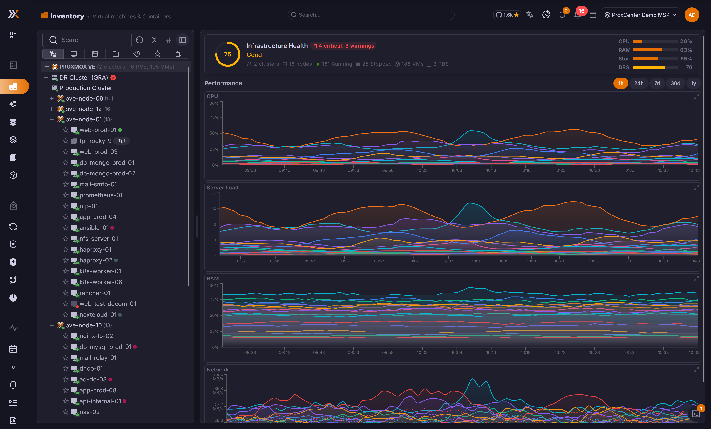
</p>

---

## Quick Start

```bash
# Community Edition (Free)
curl -fsSL https://proxcenter.io/install/community | sudo bash

# Enterprise Edition
curl -fsSL https://proxcenter.io/install/enterprise | sudo bash -s -- --token YOUR_TOKEN
```

The installer sets up Docker, the Compose stack, PostgreSQL and the persistent volumes under `/opt/proxcenter`. When it finishes, open `http://your-server:3000` and create the first admin account.

Running behind a reverse proxy? Enable the *"Behind reverse proxy"* toggle in the connection settings, to prevent failover from switching to the internal node IPs.

---

## Features

- **Multi-cluster management**: monitor and operate every Proxmox cluster from one console
- **Inventory & topology**: nodes, guests, storage, networks, and the Ceph CRUSH tree at a glance
- **Cross-hypervisor migration**: bring VMs over from VMware, Hyper-V, Nutanix, and XCP-ng, including warm (CBT) migration
- **In-browser consoles**: noVNC and SPICE for QEMU guests
- **Backups & replication**: fleet-wide visibility and reporting
- **RBAC & SSO**: granular roles and scopes
- **DRS workload balancing** *(Enterprise)*: automatic load distribution via the Go orchestrator
- **Alerts, reports & notifications** *(Enterprise)*: email digests, severity routing, and scheduled reports
- **MSP mode** *(Enterprise)*: multi-tenant fleet management with license stacking
- **High availability** *(Enterprise)*: three-node control plane with a virtual IP, replicated PostgreSQL, and leader election

See the [documentation](https://docs.proxcenter.io/) for the full feature list and the Community vs Enterprise breakdown.

---

## Screenshots

<table>
  <tr>
    <td width="50%" align="center">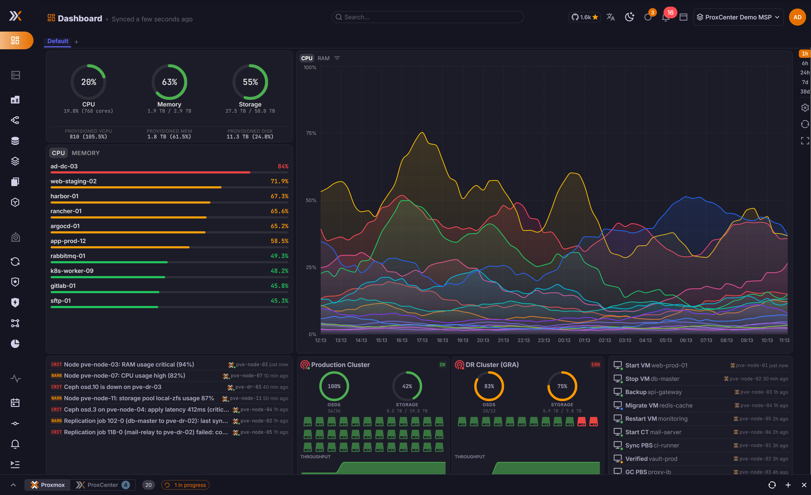<br><sub><b>Modular Dashboard</b></sub></td>
    <td width="50%" align="center">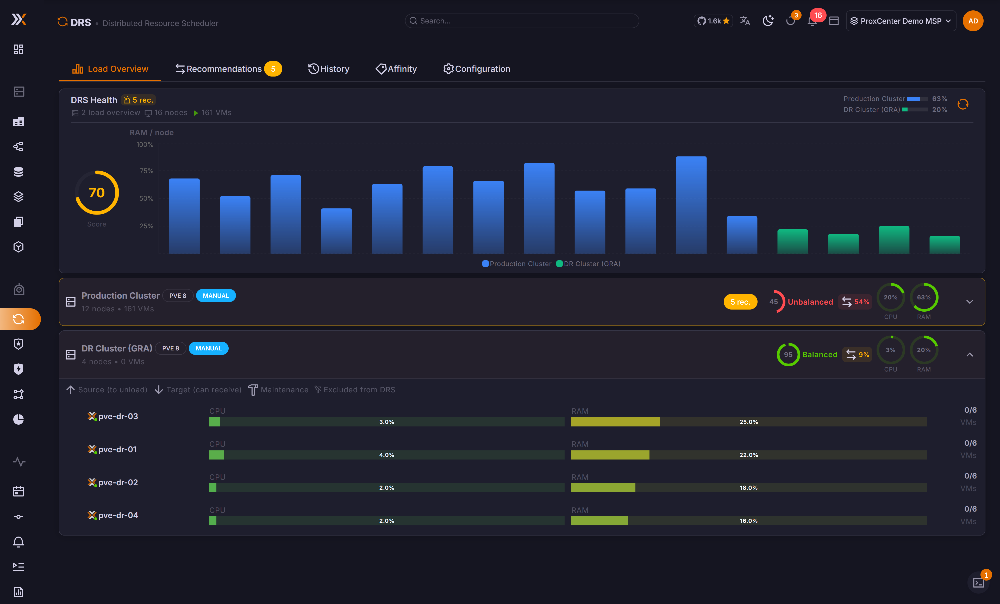<br><sub><b>DRS Load Balancing</b></sub></td>
  </tr>
  <tr>
    <td width="50%" align="center">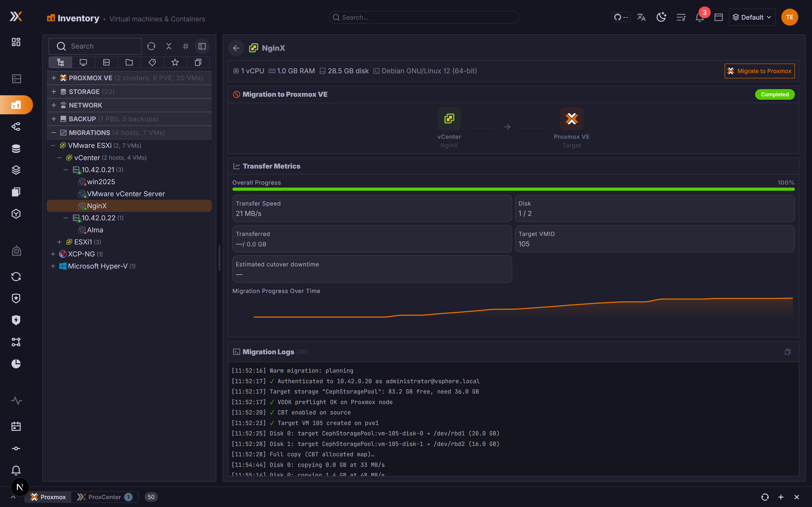<br><sub><b>Hypervisor Migration</b></sub></td>
    <td width="50%" align="center">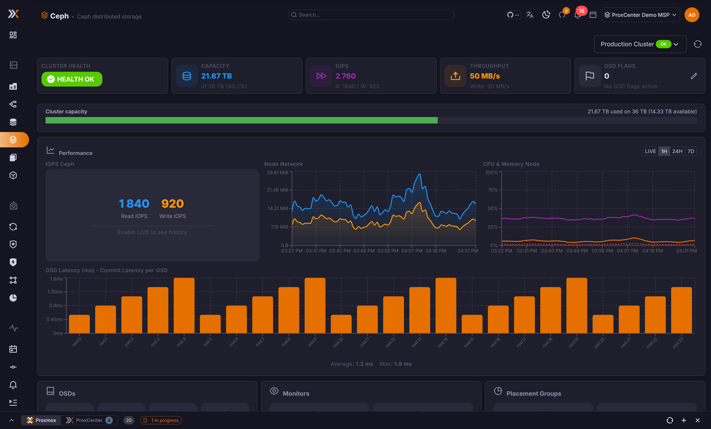<br><sub><b>Real-Time Ceph Monitoring</b></sub></td>
  </tr>
  <tr>
    <td width="50%" align="center">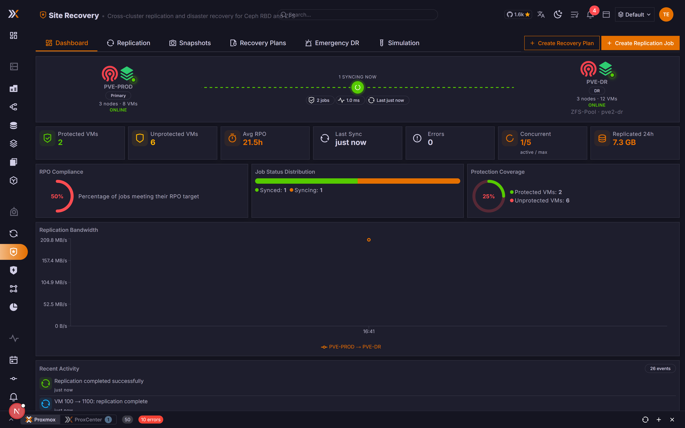<br><sub><b>Site Recovery</b></sub></td>
    <td width="50%" align="center">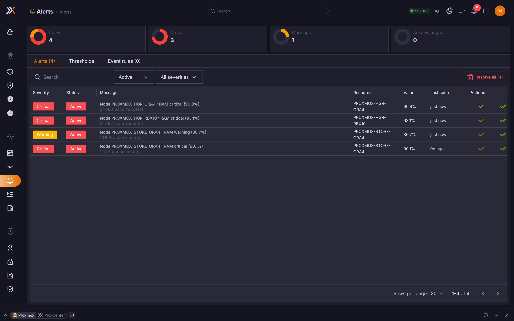<br><sub><b>Multi-channel Alerts</b></sub></td>
  </tr>
  <tr>
    <td width="50%" align="center">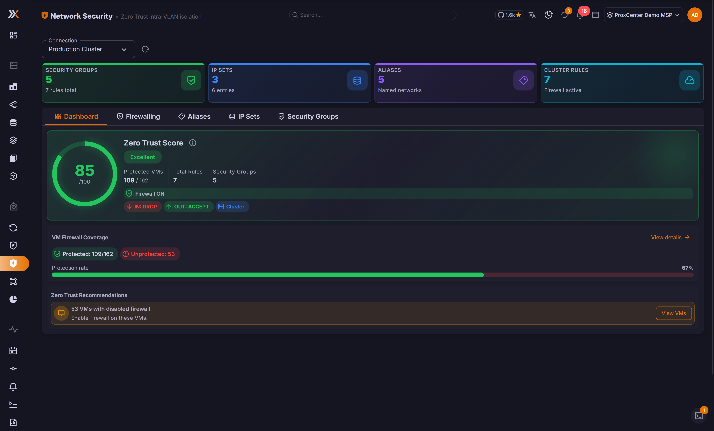<br><sub><b>Micro-segmentation (NSX)</b></sub></td>
    <td width="50%" align="center">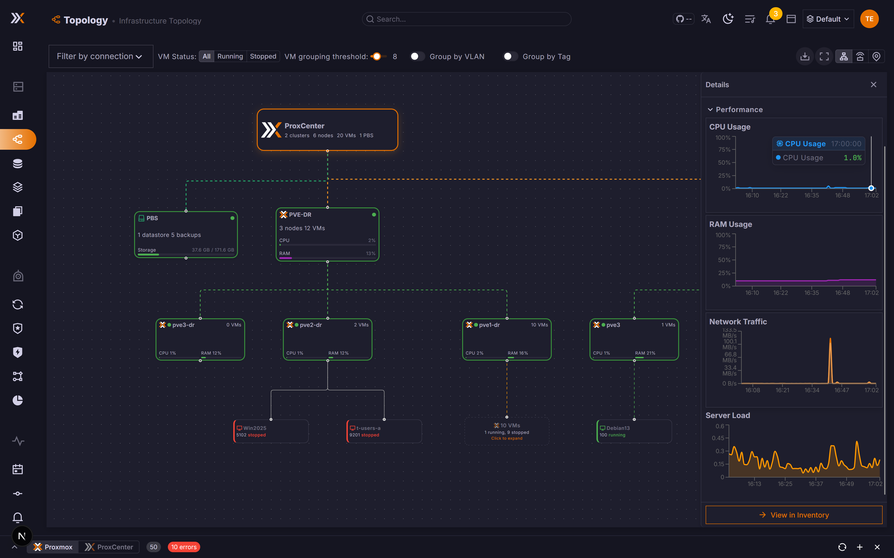<br><sub><b>Network Topology Map</b></sub></td>
  </tr>
</table>

---

## Architecture

<p align="center">
  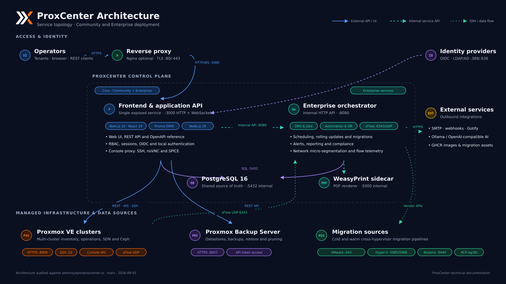
</p>

- **Single exposed port** (3000): HTTP and WebSocket served by one process, with Nginx optional in front for TLS
- **PostgreSQL** is the only source of truth, and schema migrations run at startup
- **Enterprise** adds the Go orchestrator (DRS, jobs, alerts, reports, flow telemetry) and the WeasyPrint sidecar for PDF rendering, both kept on the internal network
- Proxmox VE, Proxmox Backup Server, and the migration sources are reached outbound, with no agent to deploy

### High Availability *(Enterprise)*

<p align="center">
  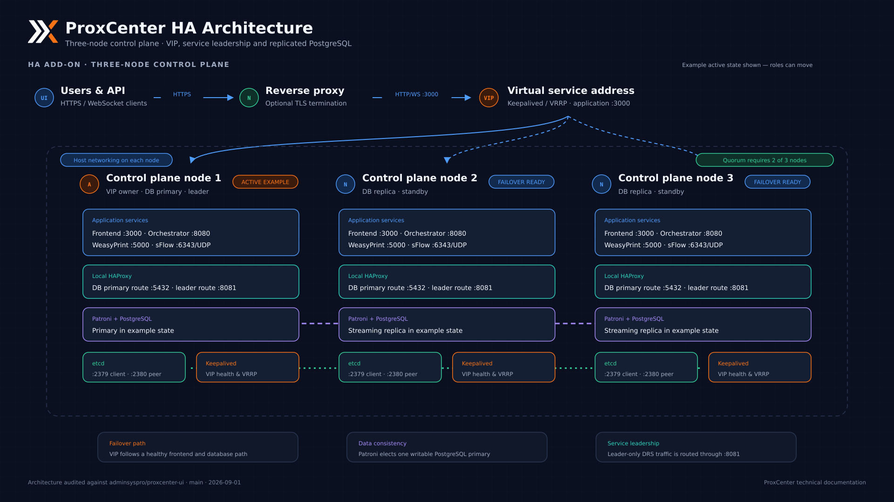
</p>

- Three nodes behind a **Keepalived VIP**, with quorum on 2 of the 3 nodes
- PostgreSQL replicated by **Patroni**, which elects the single writable primary through etcd
- A local **HAProxy** on every node routes database traffic to the current primary and leader-only traffic, DRS included, to the elected orchestrator
- Converting an existing single-node install is driven by the wizard in *Settings > High Availability*, see the [HA prerequisites](https://docs.proxcenter.io/operations/ha-prerequisites)

---

## Upgrade

Pull the new images and restart the stack:

```bash
cd /opt/proxcenter
docker compose pull
docker compose up -d
```

Schema migrations run automatically on startup. Nothing else is required for a Community install.

**Enterprise, when a release adds a setting**: `docker compose pull` refreshes the images, never `docker-compose.yml`, and the shipped Compose files pass their environment through an explicit `environment:` list. A setting introduced by a newer release therefore never reaches the container on a pull-only update, whatever `/opt/proxcenter/.env` holds. Re-run the installer to refresh the Compose file:

```bash
curl -fsSL https://proxcenter.io/install/enterprise | sudo bash -s -- --token YOUR_TOKEN
```

It keeps your secrets, your customised `NEXTAUTH_URL` and `APP_URL`, and your license key, leaves the data untouched, then pulls and recreates only the containers whose environment changed. An install that pinned a version in `.env` has to pass it again with `--version`, since a re-run otherwise resets it to `latest`.

**High availability**: the three nodes run the same Compose file, so the same two commands apply per node. Upgrade one node at a time and keep the version identical across the cluster.

**Coming from v1.3.x or earlier**: SQLite support was removed in v1.4.0 and there is no in-place migration to PostgreSQL. Follow [Upgrade to v1.4](https://docs.proxcenter.io/getting-started/upgrade-v1-4) for the cutover.

Checking the result:

```bash
cd /opt/proxcenter
docker compose ps               # Service status
docker compose logs -f          # Follow the logs
docker compose restart          # Restart the stack
```

---

## Requirements

- **Host**: Linux with Docker Engine 24+ and Docker Compose v2
- **Sizing**: 2 GB RAM and 10 GB disk minimum, more for database growth
- **Ports**: 3000 inbound, outbound to Proxmox VE 8006 and Proxmox Backup Server 8007
- **Proxmox**: Proxmox VE 8.x or 9.x

High availability adds its own sizing and network prerequisites, listed in the [documentation](https://docs.proxcenter.io/operations/ha-prerequisites).

## Security

Automated scanning via **CodeQL**, **Trivy**, and **Dependabot**. Report vulnerabilities to [security@proxcenter.io](mailto:security@proxcenter.io).

## License

- **Community**: Free for personal and commercial use
- **Enterprise**: Commercial license

## Support

- Community: [GitHub Issues](https://github.com/adminsyspro/proxcenter-ui/issues)
- Enterprise: [support@proxcenter.io](mailto:support@proxcenter.io)
